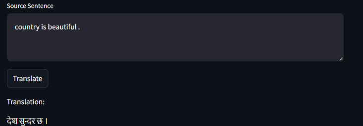
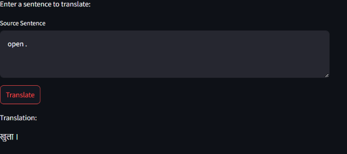
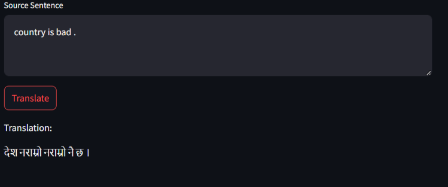

# 🌐 English to Nepali Translator

This repository contains a simple yet effective model for translating English text into Nepali. The model has been trained using a dataset of approximately 5 million English-Nepali sentence pairs.
Here's how you can add a section to your README for showcasing the output with the image you'll provide:

---

## 📸 Sample Output

Below is a screenshot of the English to Nepali Translator in action:
**Screenshot 1:**


**Screenshot 2:**


**Screenshot 3:**



## ✔️ Features

- **Customizable Training**: The model is fully adjustable, allowing you to train it with your own dataset if you wish to improve or adapt the translation quality to specific needs.
- **Efficient Training**: With the provided dataset, the model was trained over 22 epochs at kaggle , which took around 6 hours on a P100 GPU.

## 🚀 How to Run

### 📥 Clone the Repository

First, clone the repository to your local machine:

```bash
git clone https://github.com/Puzan789/English_to_Nepali_Translator-Transformer-based-.git

```

### ⚙️ Set Up Virtual Environment

Create and activate a virtual environment to keep your dependencies isolated:

```bash
python -m venv venv
.\venv\Scripts\activate  # On Windows
source venv/bin/activate  # On MacOS/Linux
```

### 📦 Install Dependencies

Install the required packages using `requirements.txt`:

```bash
pip install -r requirements.txt
```

### ▶️ Run the Application

Once everything is set up, you can directly run the Streamlit app:

```bash
streamlit run streamlit_app.py
```

This will launch a web interface where you can input English sentences and get the corresponding translations in Nepali.

## 🛠️ Training

To retrain the model with your own dataset:

1. Replace the existing dataset files with your own data in the `weights/` directory.
2. Adjust the training parameters in `config.py` as necessary.
3. Run the training script using the following command:

```bash
python model.py
```

Please note that training times will vary depending on the size of your dataset and the computational resources available.

## 📝 Notes

- The provided training took around 6 hours with a dataset of approximately 5 million sentences in both English and Nepali.
- You may need to adjust the number of epochs, batch size, and other hyperparameters in `config.py` based on your specific dataset and requirements.

## 🔍 Understanding the Transformer Architecture

The model used in this project is based on the Transformer architecture, a state-of-the-art model introduced by Vaswani et al. in their 2017 paper "Attention is All You Need". 

### 🔑 Key Concepts:

- **Self-Attention Mechanism**: The Transformer uses self-attention to weigh the importance of different words in a sentence, allowing the model to understand context better than previous models like RNNs or LSTMs.
  
- **Positional Encoding**: Since the Transformer model doesn’t have a sequential structure like RNNs, it uses positional encodings to inject information about the position of words in a sentence, helping it understand the order of words.
  
- **Encoder-Decoder Structure**: The Transformer is composed of an encoder to read the input text (English) and a decoder to generate the output text (Nepali). Both the encoder and decoder are composed of several layers of self-attention and feedforward neural networks.
  
- **Parallelization**: Unlike RNNs, which process words sequentially, the Transformer processes all words in a sentence simultaneously, allowing for faster training and inference.

### 🧠 Why Transformers?

Transformers are highly efficient for translation tasks because they can capture complex relationships between words and phrases in different languages. Their ability to process words in parallel also makes them faster to train and deploy, particularly when dealing with large datasets.

